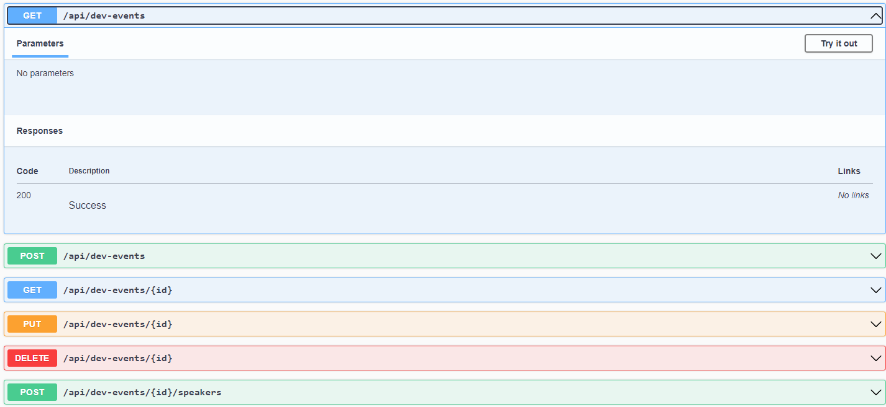

# 🚀  API CRUD para Cadastro de Eventos

Esta é uma API CRUD desenvolvida em C# usando ASP.NET Core para o cadastro e gerenciamento de eventos, onde também é possível associar palestrantes a esses eventos.

## 🛠️ Funcionalidades

- **Listar todos os eventos:** Retorna uma lista de todos os eventos cadastrados.
- **Buscar evento por ID:** Retorna um evento específico com base no seu ID.
- **Adicionar novo evento:** Permite adicionar um novo evento.
- **Atualizar evento:** Permite atualizar informações de um evento existente.
- **Excluir evento:** Permite excluir um evento existente.
- **Associar palestrante a um evento:** Permite associar um palestrante a um evento existente.
  
## 📦 Estrutura do Projeto

O projeto está estruturado da seguinte forma:

- **Controllers:** Contém os controladores responsáveis por receber as requisições HTTP e retornar as respostas adequadas.
- **Entities:** Contém as classes que representam as entidades do domínio, como Evento e Palestrante.
- **Persistence:** Contém a classe `DevEventDbContext`, responsável por simular um contexto de banco de dados em memória.
- **Program.cs:** Contém o ponto de entrada da aplicação.

## 🛑 Requisitos e Dependências

- .NET 5 SDK ou superior
- Pacotes NuGet: Microsoft.AspNetCore.Mvc

## 🎉 Como Executar o Projeto

1. Certifique-se de ter o .NET 5 SDK instalado na sua máquina.
2. Clone este repositório.
3. Abra o projeto em sua IDE de preferência.
4. Execute o projeto.


## 💬 Exemplos de Uso




### Listar todos os eventos

```http
GET /api/dev-events
```

### Buscar evento por ID

```http
GET /api/dev-events/{id}
```

### Adicionar novo evento

```http
POST /api/dev-events
```

**Corpo da requisição:**

```json
{
  "title": "Nome do Evento",
  "description": "Descrição do evento",
  "startDate": "2024-02-11T10:00:00",
  "endDate": "2024-02-12T18:00:00"
}
```

### Atualizar evento

```http
PUT /api/dev-events/{id}
```

**Corpo da requisição:**

```json
{
  "title": "Novo Nome do Evento",
  "description": "Nova Descrição do evento",
  "startDate": "2024-02-11T09:00:00",
  "endDate": "2024-02-12T17:00:00"
}
```

### Excluir evento

```http
DELETE /api/dev-events/{id}
```

### Associar palestrante a um evento

```http
POST /api/dev-events/{id}/speakers
```

**Corpo da requisição:**

```json
{
  "nome": "Nome do Palestrante",
  "talkTitle": "Título da Palestra",
  "talkDescription": "Descrição da Palestra",
  "linkedinProfile": "https://www.linkedin.com/in/palestrante"
}
```

## 📞 Contato
Use o meu linkedin caso queira entrar em contato comigo

[Meu LinkedIn - João Vitor Farias Soares](https://www.linkedin.com/in/jo%C3%A3o-vitor-farias-soares-216870238/)

